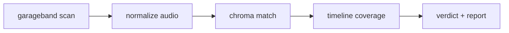

# Human Music

Verify that released audio was produced from a DAW project — starting with GarageBand `.band` bundles.

## Layout

```
human_music/
├── project/          # specs, experiments, scripts
├── data/             # example projects, benchmarks, reports
└── src/
    ├── app/                  # Tauri desktop UI
    ├── verification_engine/  # provenance pipeline (CLI: gb-verify)
    └── daw_interfaces/
        └── garageband/       # .band scanner + metadata
```

## Quick start

**CLI** — verify a project against released audio:

```bash
cargo run -p verification_engine --release -- \
  --catalog-dir data/ \
  --project data/example_1/'כל מה .band' \
  --audio   data/example_1/'כל מה  - 21:06:2026, 18.49.mp3' \
  --out     /tmp/gb-report
```

**Desktop app:**

```bash
cd src/app && npm install && npm run dev
```

## Crates

| Crate | Path | Role |
|-------|------|------|
| `garageband` | `src/daw_interfaces/garageband` | Parse `.band` bundles, collect GB metadata |
| `verification_engine` | `src/verification_engine` | Normalize → chroma match → coverage → verdict |
| `gb-verify-app` | `src/app/src-tauri` | File pickers, progress UI, in-process verify |

## Pipeline



Decisions and rationale live in [`project/running_spec.md`](project/running_spec.md).
